# 📋 Flutter To-Do List App

A professional and feature-rich Flutter To-Do List app with login/signup, light/dark theme switching, voice input, smart task management, and list sharing as PDF.

---

## ✨ Features

- 🔐 Secure login with email/phone and strong password validation
- 🎨 Light and Dark themes with smooth toggle
- ✅ Create, edit, delete, and mark tasks complete
- ⏰ Set due dates
- 🗃️ Organize with custom task lists
- 🖼️ Blurred background UI and animated drawer
- 📤 Export and share task lists as PDF (WhatsApp, Instagram, etc.)

---

## 📸 App Screenshots

### 🔐 Authentication

<table>
  <tr>
    <td><strong>Login</strong></td>
    <td><strong>Signup</strong></td>
  </tr>
  <tr>
    <td>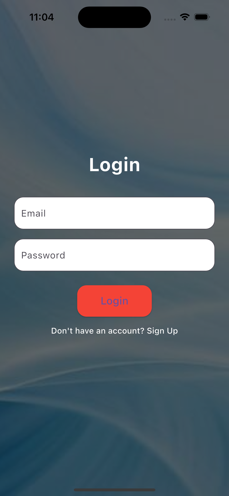</td>
    <td>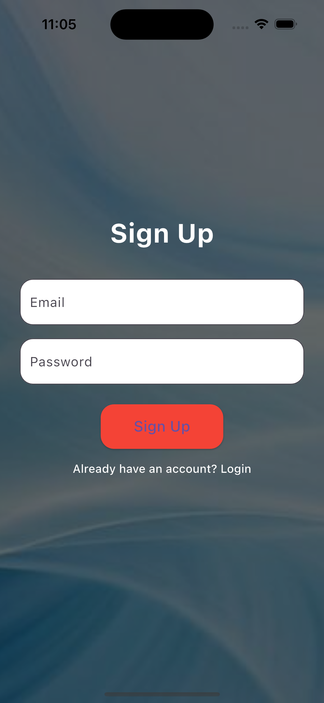</td>
  </tr>
</table>

---

### 🏠 Main Features

<table>
  <tr>
    <td><strong>Home</strong></td>
    <td><strong>App Drawer</strong></td>
    <td><strong>Dark Mode</strong></td>
  </tr>
  <tr>
    <td>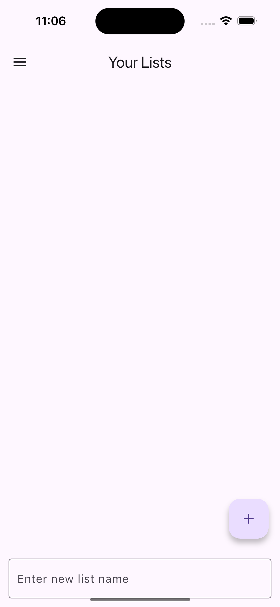</td>
    <td>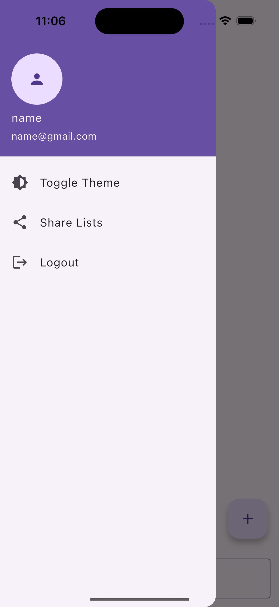</td>
    <td>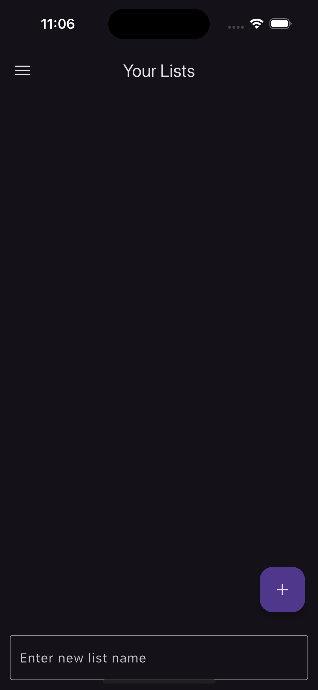</td>
  </tr>
</table>

---

### 📝 Task Features

<table>
  <tr>
    <td><strong>Add Task</strong></td>
    <td><strong>Edit Task</strong></td>
    <td><strong>Add Deadline</strong></td>
    <td><strong>Mark Done</strong></td>
  </tr>
  <tr>
    <td>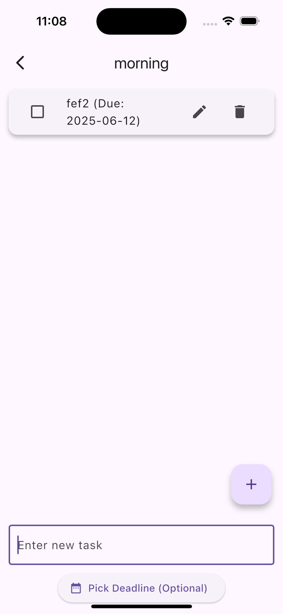</td>
    <td>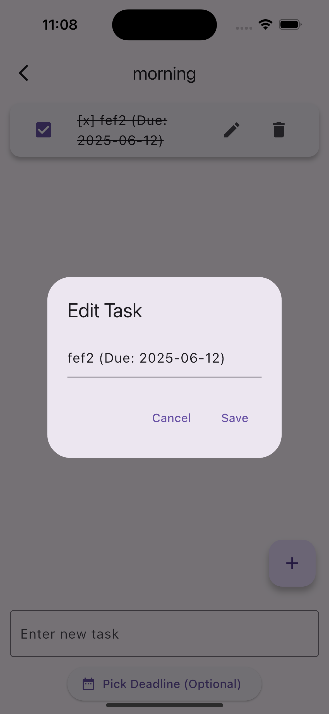</td>
    <td>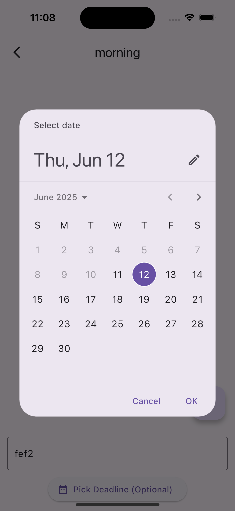</td>
    <td>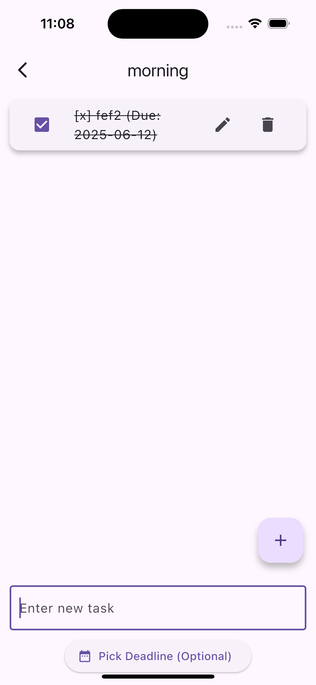</td>
  </tr>
</table>

---

### ➕ Lists and Sharing

<table>
  <tr>
    <td><strong>Add List</strong></td>
    <td><strong>Share Task</strong></td>
  </tr>
  <tr>
    <td>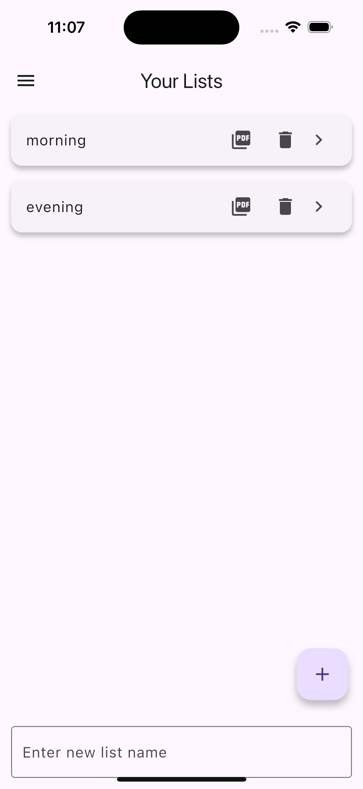</td>
    <td>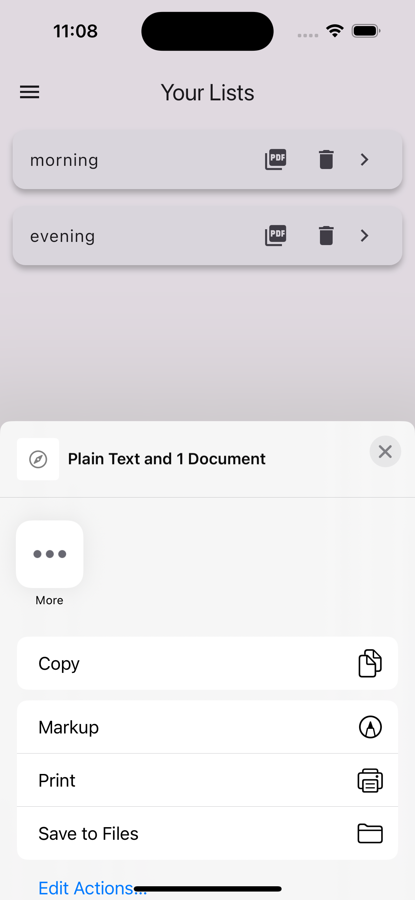</td>
  </tr>
</table>
